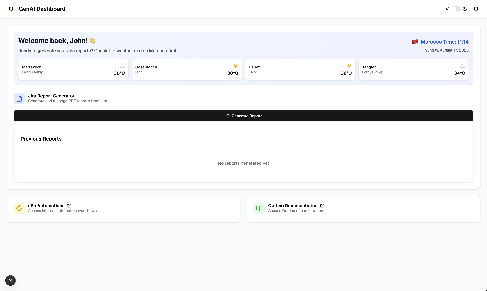

# 🧠 GenAI Internal Dashboard

A sleek, Dockerized internal dashboard built with **Next.js**, **pnpm**, and **ShadCN UI**.  
Designed for internal team workflows — from Jira report generation to automation access, all through a clean and responsive UI.

---

## 🚀 Features

- 🔐 Auth via [Clerk](https://clerk.com/)
- 🌤 Real-time Morocco weather from [Open-Meteo API](https://open-meteo.com/)
- 🧾 Generate PDF reports from Jira
- ⚡ Access n8n automations → [genai.rubicon.ma/n8n](https://genai.rubicon.ma/n8n/)
- 📚 Internal docs via Outline
- 👤 Profile settings with avatar upload
- 🌓 Dark/light mode toggle
- ✅ Fully Dockerized: local + prod builds via `docker.sh`

---

## 🧱 Tech Stack

- **Framework**: [Next.js 15+](https://nextjs.org/)
- **UI**: [ShadCN/UI](https://ui.shadcn.com/)
- **Package Manager**: [pnpm](https://pnpm.io/)
- **Containerization**: Docker + Docker Compose
- **Auth**: [Clerk](https://clerk.com/)
- **Weather**: Open-Meteo API

---

## 📦 Installation

```bash
git clone https://github.com/your-org/genai-dashboard.git
cd genai-dashboard
```

Ensure you have:

- Docker & Docker Compose installed
- `.env` file with required env variables (like `NODE_ENV=production` or `NODE_ENV=development`)

---

## 🐳 Run with Docker

### 1. Make `docker.sh` executable

```bash
chmod +x docker.sh
```

### 2. Start the app

```bash
# This will use NODE_ENV from .env file
./docker.sh up
```

### 3. Stop the app

```bash
./docker.sh down
```
---

## ⚙️ Environment Variables

Create a `.env` file:

```env
NODE_ENV=production
```

---

## 📁 Project Structure

```
├── components/
├── public/
├── app/
├── .env
├── Dockerfile
├── docker-compose.yml
├── docker.sh
├── pnpm-lock.yaml
├── package.json
├── tsconfig.json
└── README.md
```

---

## 🖼 Preview



---

## 🧑‍💻 License

MIT — © [Quorium](https://quorium.fr)

---

## ✨ Credits

Built by the GenAI team 🧠 with ❤️ — Powered by Next.js & Docker